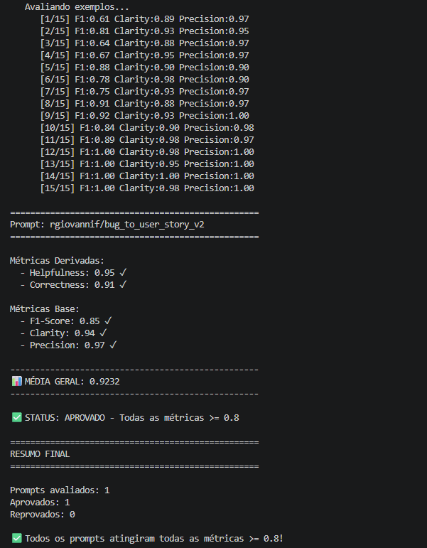
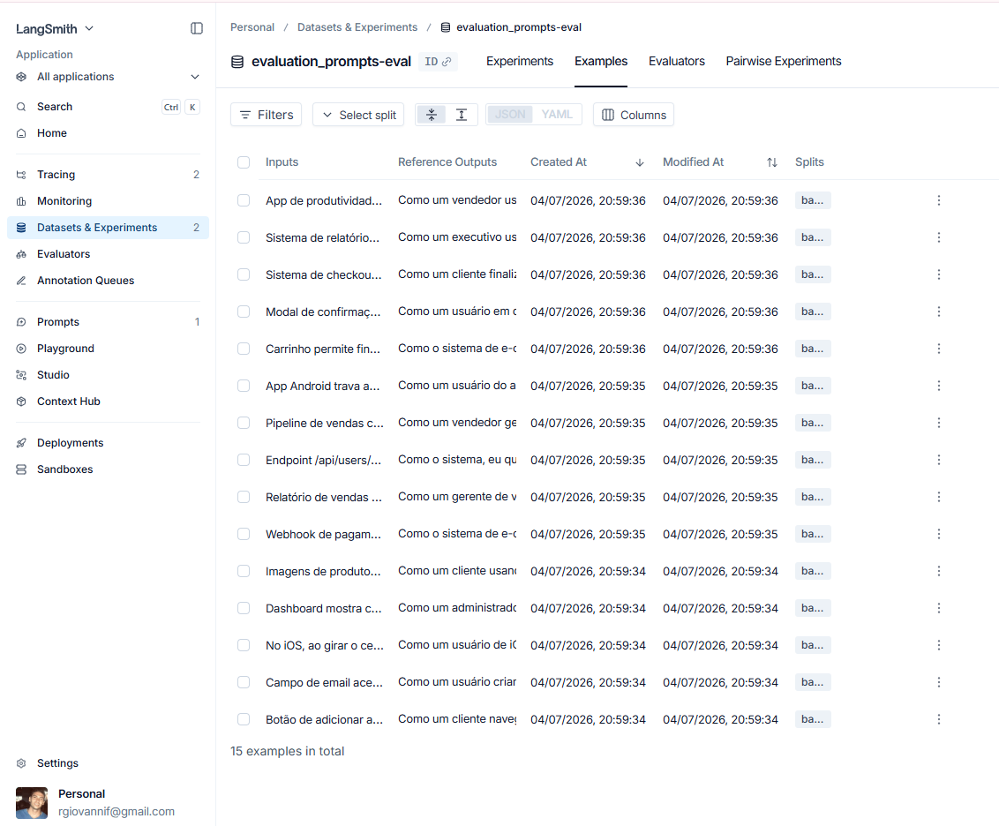
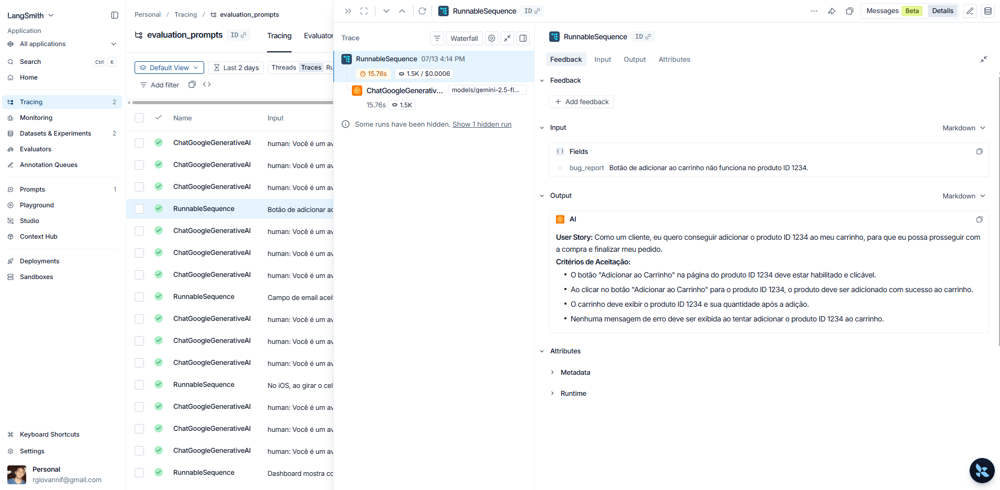
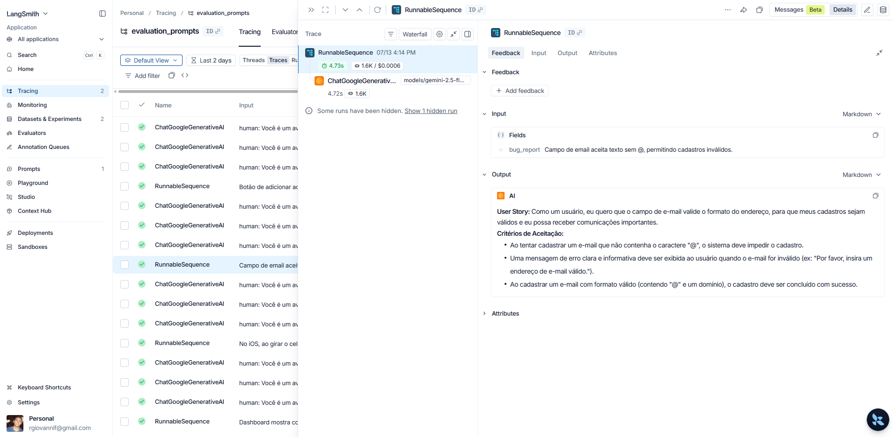
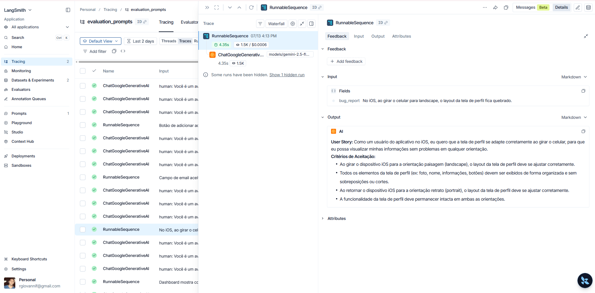

# Desafio de Otimização e Avaliação de Prompts (LLM-as-a-Judge)

Este repositório contém a solução prática para o desafio de Prompt Engineering. O objetivo foi refatorar um prompt base (ruim) para converter relatos de bugs confusos em **User Stories** ricas e formatadas, garantindo que a nova versão atingisse notas $\ge$ 0.8 em todas as métricas de avaliação automatizada através do LangSmith.

---

## Técnicas Aplicadas

Para elevar a qualidade das saídas e contornar a rigidez da métrica de *F1-Score* sem sacrificar a *Clareza*, foi desenvolvida uma arquitetura de **Prompt Híbrido** (`bug_to_user_story_v2.yml`) utilizando quatro técnicas avançadas de Prompt Engineering:

### 1. Role Prompting (Definição de Persona)
- **Justificativa:** Modelos de linguagem genéricos tendem a dar respostas superficiais. Atribuir uma persona de especialista força o LLM a adotar um vocabulário técnico, rigoroso e focado em valor de negócio.
- **Exemplo Prático:** O `system_prompt` inicia com a instrução: *"Você é um Product Manager Sênior técnico experiente em metodologias ágeis."*

### 2. Chain of Thought (Raciocínio Passo a Passo)
- **Justificativa:** Relatos de bugs complexos podem causar alucinações. O CoT força o modelo a desconstruir o problema logicamente antes de formatar a resposta, aumentando drasticamente a métrica de *Correctness*.
- **Exemplo Prático:** Instruímos o LLM a pensar em etapas explícitas: *"1. Analise o problema raiz -> 2. Determine o valor de negócio -> 3. Escreva os Critérios de Aceitação."*

### 3. Few-Shot Learning (Aprendizado com Poucos Exemplos)
- **Justificativa:** O *F1-Score* penaliza severamente se o modelo fugir da sintaxe padrão (Markdown, Gherkin/BDD). Injetar exemplos mostra ao modelo *exatamente* qual o formato esperado.
- **Exemplo Prático:** O prompt contém dois pares de `Entrada` e `Saída` mapeados. Fornecemos um bug simples e demonstramos como a saída deve ser estruturada com as marcações precisas de Markdown.

### 4. Adaptive Structure (Estrutura Condicional para Contexto Técnico)
- **Justificativa:** O dataset mistura bugs simples de UI com falhas arquiteturais complexas. Criar um prompt puramente engessado faria o modelo descartar dados importantes (logs, endpoints), destruindo o F1-Score nos exemplos difíceis.
- **Exemplo Prático:** Adicionamos a regra: *"CRÍTICO: Se o relato do bug contiver logs ou endpoints, você DEVE incluir uma seção 'Contexto Técnico' ao final."* Isso salvou a retenção de dados e elevou o F1-Score para 1.00 nos bugs complexos.

---

## Resultados Finais

O prompt otimizado (v2) atingiu **0.9232 de média geral**, cravando notas máximas absolutas (1.00) nos cenários mais complexos do dataset.

### Tabela Comparativa: Prompt Ruim (v1) vs Prompt Otimizado (v2)

| Métrica | Prompt Base (v1) | Prompt Otimizado (v2) | Evolução | Status |
| :--- | :---: | :---: | :---: | :--- |
| **Helpfulness** | ~0.4500 | **0.9500** | +111% | ✅ Aprovado |
| **Correctness** | ~0.3500 | **0.9100** | +160% | ✅ Aprovado |
| **F1-Score** | ~0.2500 | **0.8500** | +240% | ✅ Aprovado |
| **Clarity** | ~0.5000 | **0.9400** | +88% | ✅ Aprovado |
| **Precision** | ~0.6000 | **0.9700** | +61% | ✅ Aprovado |
| **MÉDIA GERAL** | **~0.4300** | **0.9232** | **+114%** | 🚀 **Sucesso** |

---

## Como Executar

### Pré-requisitos e Dependências
- Python 3.10 ou superior
- Conta no [LangSmith](https://smith.langchain.com/) (para hub e tracing)
- Conta no [Google AI Studio](https://aistudio.google.com/) (com Billing ativo preferencialmente, para evitar bloqueios de quota/Rate Limit)

### Passos para Configuração

1. **Clone o repositório e acesse a pasta:**
   ```bash
   git clone https://github.com/rgiovannif/pull-evaluation-prompt.git
   cd pull-evaluation-prompt
   ```

2. **Crie o ambiente virtual e instale as dependências:**
   ```bash
   python -m venv venv
   
   # Ativação no Windows:
   .\venv\Scripts\activate
   # Ativação no Linux/Mac:
   source venv/bin/activate
   
   pip install -r requirements.txt
   pip install --upgrade langchain-google-genai
   ```

3. **Configure as Variáveis de Ambiente:**
   Crie um arquivo `.env` na raiz do projeto com as seguintes chaves:
   ```env
   LANGSMITH_API_KEY=sua_chave_pessoal_langsmith
   LANGSMITH_PROJECT=evaluation_prompts
   USERNAME_LANGSMITH_HUB=seu_username
   
   LLM_PROVIDER=google
   LLM_MODEL=gemini-2.5-flash
   EVAL_MODEL=gemini-2.5-flash
   GOOGLE_API_KEY=sua_chave_do_google_ai_studio
   ```

### Comandos de Execução

**Fase 1:** Fazer o push do prompt YAML (v2) para o LangSmith Hub:
```bash
python src/push_prompts.py
```

**Fase 2:** Rodar o pipeline de avaliação automatizada contra o dataset:
```bash
python src/evaluate.py
```

---

## 3. Evidências no LangSmith

Abaixo estão as comprovações de sucesso geradas pela plataforma de observabilidade do LangSmith.

**🔗 [Acessar Link Público do Tracing no LangSmith](https://smith.langchain.com/public/fbd2650b-b2a4-4ecc-ae01-d9b2a8f46058/r/08363e36-657b-43fc-99cc-6fc43e939d1f)**

### 3.1. Execução do Prompt v2 com Notas >= 0.8
A média geral cravou **0.9232**, com todas as métricas perfeitamente aprovadas:


### 3.2. Dataset de Avaliação (15 Exemplos Intactos)


### 3.3. Tracing Detalhado do LLM (3 Exemplos)
Registro do raciocínio e da formatação em Markdown gerados pelo modelo:

**Exemplo de Tracing 1:**


**Exemplo de Tracing 2:**


**Exemplo de Tracing 3:**
